# 课程介绍


本阶段的课程总共分为两部分：

第一部分：css3的相关属性学习，能够使用字体图标，利用css3的新属性完成市场常见的网页效果；

第二部分：移动端网页的制作（https://m.bilibili.com/）(https://m.jd.com/)(https://m.suning.com/)


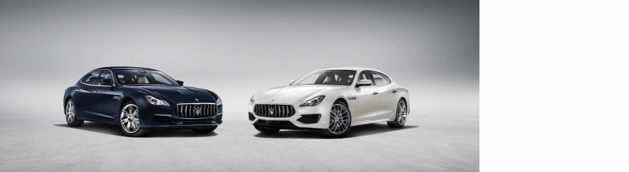

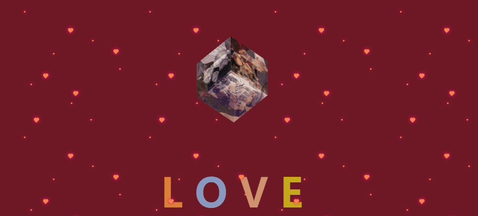

# 第一天

## 目标

01、掌握字体图标iconfont的使用；

02、能够使用css3的平面转换（2D转换）完成相应的网页效果；

03、掌握css3的渐变；


## ★★★字体图标iconfont

### 简介

实际开发中我们可以将一些简单的颜色单一的小图标，我们可以使用字体图标实现，可以使用文字的相关属性控制样式；

**优势：**

- **灵活性：**灵活地修改样式，例如：尺寸、颜色等 ；
- **轻量级：**体积小、渲染快、降低服务器请求次数 ；
- **兼容性：**几乎兼容所有主流浏览器  使用方便； 
- **使用方便：**  下载字体包  ➜  使用字体图标；


### ★★★下载图标

打开官网：https://www.iconfont.cn/  注册自己的账号登录；

- 第一步：打开网站，搜索选择自己想要的图标，点击到购物车。
- 第二步：打开购物车，添加至项目（如果是新的项目就需要点击+号创建自己的新项目），点击确定即可；
- 第三步：资源管理--- 我的项目 --- 我发起的项目 --- 下载至本地；

### ★★★图标的使用

第一步：将下载的压缩包解压，打开里面的文件夹更改名字为iconfont即可，复制到自己的项目；

第二步：将iconfont.css文件引入到自己的html文件中；

```html
<link rel="stylesheet" href="./iconfont/iconfont.css">
```

第三步：字体的调用，打开demo_index.html页面我们最常用的是Unicode和Font class两种；

**Unicode的使用**

使用Unicode字体编码的时候前两步我们可以直接跳过，因为前面我们已经引入了iconfont.css里面都包含了；

**注意：Unicode字体编码需要在前面的字符展示中复制，调用字符的标签必须调用iconfont的font-family字体；**

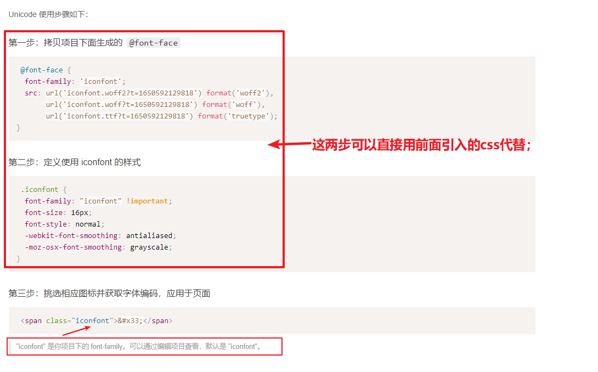

**Font class的使用**

Font class是使用图标对应的class类名进行调用字体的，第一步就是引入了iconfont.css；

**注意：调用字符的标签必须调用iconfont的font-family字体，然后利用多类名调用方式直接将对应图标的类名复制过来添加到class中即可；**

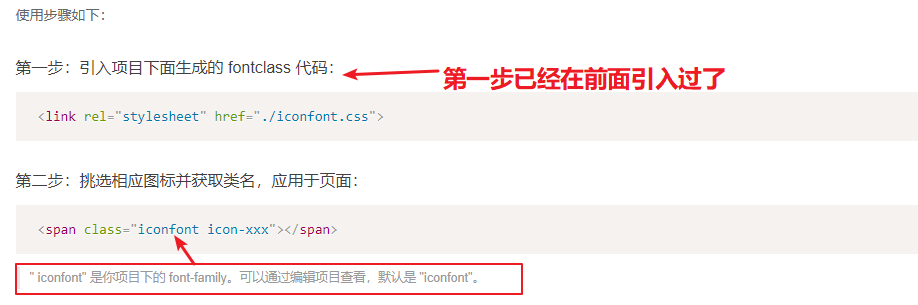

### ★★★图标样式修改

修改iconfont图标的样式的时候一定要注意样式的优先级，我们建议直接利用后代选择器修改iconfont类名的样式，或者利用后代选择器修改复制的图标类名(icon-xxx);

```html
 <i class="iconfont icon-shouji"></i>
```

```css
.search  .iconfont {
    font-size: 19px;
}
.search  .icon-shouji {
    font-size: 19px;
}
```

### 上传图标

- svg格式的图标是由UI提供；
- 需要将svg格式图标上传到iconfont官网，站然后下载使用；
- 官网教程：https://www.iconfont.cn/help/detail?spm=a313x.7781069.1998910419.23&helptype=draw

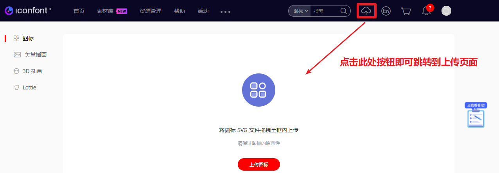

### 目标案例（课间自主完成）

根据所学知识下载对应的iconfont图标完成以下购物车案例；

> 购物车盒子大小：宽200px，高50px，border是1px的灰色，文字大小18px，文字颜色#333；
>
> 图标颜色：自己利用所学知识吸取；

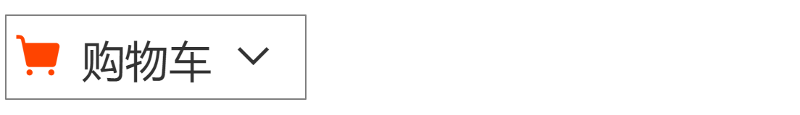


## css3的transform 属性

transform属性应用于元素的2D(平面)或3D(空间)转换。这个属性允许你将元素旋转，缩放，移动，倾斜等；

**注意：设置了css3转换的盒子，如果盒子的位置改变了，是不会影响其他盒子的位置显示；**

## ★★★2D(平面)转换

学习平面转换我们要知道在平面坐标系中水平和垂直方向的取值规则；

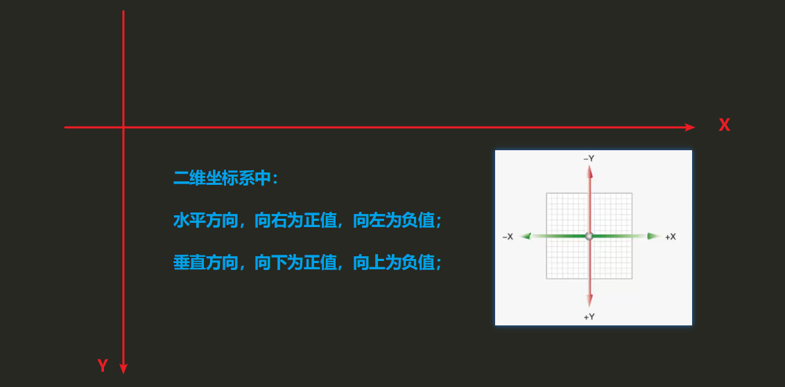

### 位移 translate

#### 基本语法

| 语法                           | 描述                                                         |
| ------------------------------ | ------------------------------------------------------------ |
| transform: translate(X,Y)      | X表示元素在水平方向移动的距离<br />Y表示元素在垂直平方向移动的距离 |
| transform: translateX(x位移)   | 单独控制水平方向的移动距离                                   |
| transform: translateY(y的位移) | 单独控制垂直方向的移动距离                                   |

#### 取值规范：

​	实际的像素单位数值
​	百分比（参照元素盒子自身的尺寸计算）；

#### 目标案例：

> ***01、定位盒子水平垂直居中显示（思考基础学习的知识如何实现？？）；***
>
> ***02、双开门效果；***
>
> [案例链接]: ../第一天资料\视频配套资料/01-案例\02-平面转换/03-案例-双开门/demo.html
>
> 大盒子宽度为1366px，高度为600px；
>
> 遮罩层大小为都是1366的一半，高度为600px；


### 旋转 rotate

#### 基本语法

| 语法                     | 描述                                                         |
| ------------------------ | ------------------------------------------------------------ |
| transform: rotate(angle) | angle是需要旋转的度数，必须加deg单位；或者取turn单位表示圈数； |

#### **注意事项**：

01、旋转的角度或者圈数：

**取值为正值：顺时针旋转** 

```css
 transform: rotate(45deg);
```

**取值为负值：逆时针旋转** 

```css
 transform: rotate(-45deg);			
```

02、rotate旋转是从某一个角度旋转到另一个角度； 

#### 转换原点 transform-origin

##### 默认原点为中心点

```css
transform-origin: 50% 50%;
transform-origin: center center;
```

取值为方位名词

```css
transform-origin: left top;
transform-origin: left bottom;
transform-origin: right top;
transform-origin: right bottom;
transform-origin: center bottom;
```

取值百分比

```css
transform-origin:30% 20%;
```

取值实际像素

```css
transform-origin:20px 30px;
```

#### 目标案例

**传智列表**

> 大盒子宽834px，高135px，描边border是2px的灰色；
>
> 小盒子宽200px，高131px，每一个之间的距离为10px；

**要求：完成以下布局，然后应用css3旋转属性完成动画效果；**


### 缩放 scale

#### 语法：

```css
transform: scale(x,y);
```

x表示水平缩放（宽度）
y表示垂直缩放（高度）

#### 实际的用法：

```css
transform: scale(1);
```

> 01、实际开发中取值可以是1个，表示等比缩放，如果取值为1表示原始大小不缩放，如果取值大于1表示放大的倍数，如果取值小于1表示缩小的倍数；
> **02、注意：**如果取值为1个值表示宽和高同时等比设置，如果取值为两个值，第一个值表示为宽，第二个值为高；

#### 目标案例

> [案例链接]: ../第一天资料/视频配套资料\01-案例/02-平面转换/08-和平精英-缩放/demo.html
>
> 卡片宽度249px，高度210px
>
> 图片区域高度144px
>
> 文字大小16px，文子距离父级的边距上10px，左右10px

**【和平精英】“初火”音乐概念片：四圣觉醒......**

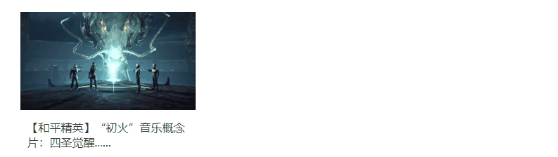

**课后练习**

> 案例链接：https://y.qq.com/
>
> 大盒子宽度 1220px，高度224px；
>
> 小图片盒子宽高都是224px，每一个之间的距离为20px；

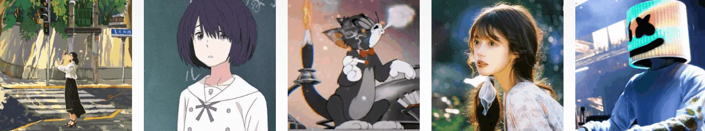


### zoom缩放（了解）

#### 取值

#####  取值为实际浮点数

如果取值为1表示原始大小不缩放，如果取值大于1表示放大的倍数，如果取值小于1表示缩小的倍数；

```css
zoom: 1;
```

##### 取值为百分比

```css
zoom: 150%;
```

> **注意**
> 01、如果给父级和设置了对应的zoom属性，该父级盒子里面的子元素会全部等比缩放；
> 02、该属性火狐浏览器和Opera浏览器的某些版本不支持；

### 复合写法

#### 语法： 

```css
transform: 位移  旋转   缩放;
transform: translateX(900px) rotate(360deg);
```

**注意：translate位移必须要写在最前面，如果旋转在最前面会导致坐标轴的位置偏移，导致问题；**

## css3渐变色

是特殊的背景图片，一般是设置给background-image

### 基本语法

```css
 background-image: linear-gradient(颜色1,颜色2,...);
```

01、默认的颜色是从上到下的渐变；

02、设置渐变的方向，在颜色前面加 to 方位名词，可以设置渐变颜色的方向；

```css
 background-image: linear-gradient(to left,颜色1颜色1,颜色2,...);
```

03、设置渐变颜色以某一个角度显示，在颜色前面加度数即可；

```css
 background-image: linear-gradient(45deg,颜色1颜色1,颜色2,...);
```


## 作业安排

完成下拉导航和QQ音乐效果；

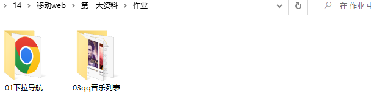


# 第二天

## 目标

01、了解3D(空间)转换，完成相应案例；

02、掌握css3关键帧动画，完成相应的网页效果；

## 3D(空间)转换

学习3D转换必须要了解3D的坐标轴走向，从空间坐标轴角度定义坐标轴，有X,Y,Z三条构成立体空间，Z轴是方向是正对视线的方向；
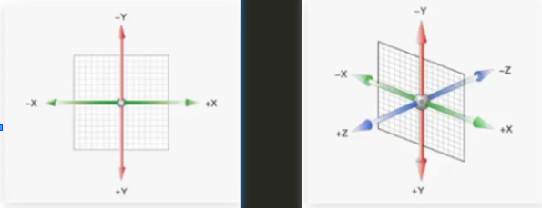	

**注意：**

**01、3D(空间)转换也是使用transform属性实现的**

**02、如果想要实现3D效果，需要坐标轴配合相关的属性才能实现，主要是<font color="red">透视（视距） perspective</font>和<font color="red">3D呈现transform-style</font>；**

### 3D位移translate3d

设置元素在3D坐标轴的移动位置；	

#### 单独设置各个坐标轴的位置

```css
transform: translateX(300px);
transform: translateY(300px);
transform: translateZ(300px);
```

#### 复合书写 translate3d(x,y,z)

```css
 transform: translate3d(300px,300px,300px);
```

**注意：**

01、如果有就书写对应的值，没有的话就用0来代替；

02、Z轴的取值的单位一般建议都是px像素单位；

### 3D旋转rotate

设置元素沿着3D坐标轴的旋转角度，取值是一个角度angle；

#### 单独设置各个坐标轴的角度

```css
transform: rotateX(360deg);
transform: rotateY(360deg);
transform: rotateZ(360deg);
```

#### 复合书写rotate3d（了解）

**语法**

```css
transform: rotate3d(x,y,z,angle);
transform: rotate3d(1,1,1,45deg);
```

用来设置自定义旋转的位置及旋转的角度，x,y,z的取值是0-1之间的数字，0表示没有，1表示有，angle正的角度值表示顺时针旋转，负值表示逆时针旋转。；

https://developer.mozilla.org/zh-CN/docs/web/css/transform-function/rotate3d

#### 左手法则

大拇指指向轴的正方向，手指弯曲的方向是3D旋转的方向；

### 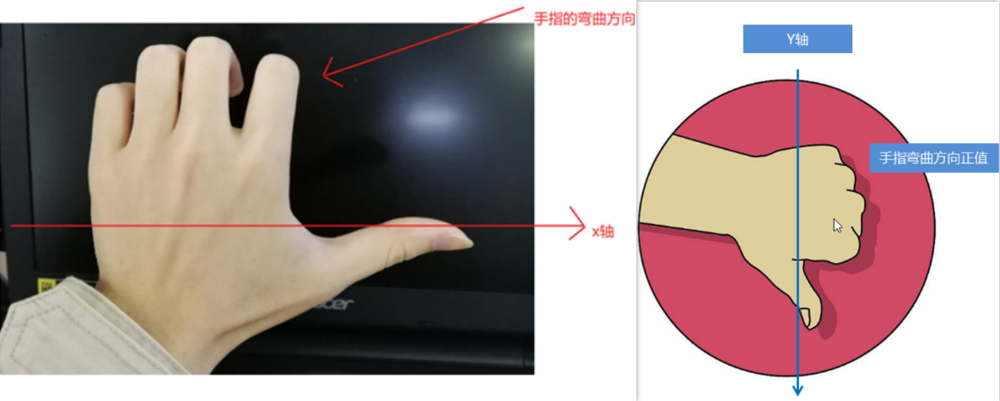透视 perspective

指定了观察者与 z=0 平面的距离，使具有三维位置变换的元素产生透视效果。 z>0 的三维元素比正常大，而 z<0 时则比正常小，大小程度由该属性的值决定。

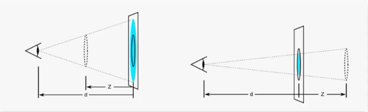

Z轴的取值正值越靠近人的眼睛，取值为负值离人的眼睛越远；

**当perspective的取值固定的时候，也就是人距离电脑屏幕的距离称为视距d：**

> z轴的取值越大，观察元素的距离会变小，被观察的物体比正常大；
>
> z轴的取值越小，观察元素的距离会变大，被观察的物体比正常小；

**注意**：
01、perspective属性要加给被观察元素的父级盒子； 
02、perspective的取值建议是800px-1200px之间；  
03、perspective的取值必须要加单位，一般建议取px； 
04、当perspective的取值固定的时候，Z轴的值接近perspective的取值就会铺满整个屏幕，Z轴的值等于或者大于perspective的取值就会将元素溢出屏幕以外；


### 3D呈现transform-style		

实际开发中是无法在2维平面内直接呈现3D效果，需要借助3D呈现属性实现；

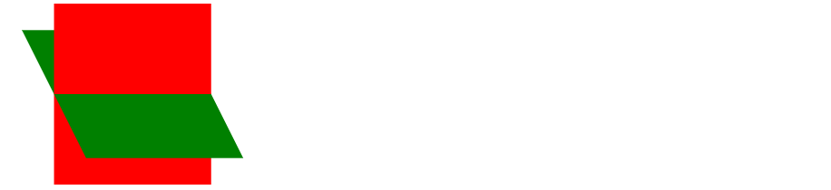

**语法/取值**

子元素不开启3D立体空间，默认值flat；

```css
transform-style:flat;  
```

**子元素开启3D立体空间，取值为preserve-3d**

```css
transform-style:preserve-3d; 
```

**注意**
该属性是加给父级盒子的，只有加给父级盒子才能让子级盒子在3D立体空间中展示；

> 书里的说明：让当前元素保留其3d样式；
> 手册的说明：让当前网页处于3d视角中；

### 缩放scale(了解)

https://developer.mozilla.org/zh-CN/docs/Web/CSS/scale


### 目标案例

**01、3D导航**

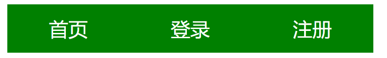

**02、思考练习**

立方体盒子的制作


## css3动画

css3动画我们目前需要掌握过渡动画和关键帧动画；

### 过渡动画（复习）

过渡动画语法：

```css
transition:  属性  动画时间   动画形式  延时;
```

**属性：**可以用all表示所有的属性，也可以单个属性设置；   
**动画时间：**单位 s，动画执行的时间；
**动画形式：**默认取值 ease先慢后快，最后慢速结束；
		   匀速 linear；
		   ease-in以慢速开始 ；
		   ease-out以慢速结束 ；
		   ease-in-out以慢速开始和结束；
**延时：**单位s，即使是0也不能省略单位，延迟动画开始执行的时间；

### 关键帧动画

通过设置多个节点（关键帧）来精确控制一个或者一组动画，常用来实现复杂的动画效果；

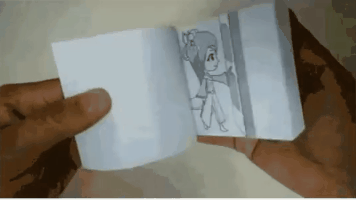

#### 基本语法

##### **第一步：定义关键帧动画**

css规定用 @keyframes关键词定义关键帧动画；

**方法1：from   to  定义动画**

```
        @keyframes 动画名称 {
            from {}

            to {}
        }
```

**方法2：百分比动画（百分比是时间总时长的占比）**		

```
        @keyframes 动画名称 {
            0% {}

            ...% {}

            100% {}
        }
```

##### 第二步：调用动画

css3规定， @keyframes定义的动画只有调用才能执行否则无效；

```
animation-name: 动画名称;
animation-duration: 2s;
```

注意：动画名称的调用和动画的运动时间必须要写否则动画不会运行；

### animation调用控制动画属性

| 属性                      | 取值                                                      | 作用（说明）                                                 |
| ------------------------- | :-------------------------------------------------------- | ------------------------------------------------------------ |
| animation-name            | 动画的名称                                                | 规定调用的是哪一个动画，必须属性；                           |
| animation-duration        | 固定的秒数                                                | 规定动画完成一个周期所花费的秒或毫秒。默认是 0。             |
| animation-timing-function | linear，ease，ease-in，ease-out，ease-in-out，steps(步数) | 规定动画的速度曲线。默认是 "ease"。                          |
| animation-delay           | 固定的秒数                                                | 规定动画何时开始。默认是 0s。必须写单位s。                   |
| animation-iteration-count | 默认取值为1，循环是infinite                               | 规定动画被播放的次数。默认是 1或者设置循环。                 |
| animation-direction       | 默认是 normal，逆向alternate                              | 规定动画是否在下一周期逆向地播放。                           |
| animation-fill-mode       | 保持现状forwards，回到起始backwards；                     | 动画在执行之前和之后如何将样式应用于其目标；                 |
| animation-play-state      | running当前动画正在运行；paused当前动画已被停止；         | 规定动画是否正在运行或暂停；可以通过查询它来确定动画是否正在运行； |


**动画的速度曲线取值**

> linear	动画从头到尾的速度是相同的。
> ease	默认。动画以低速开始，然后加快，在结束前变慢。
> ease-in	动画以低速开始。
> ease-out	动画以低速结束。
> ease-in-out	动画以低速开始和结束。
> steps(步数)   逐帧（步长）动画，设置动画完成需要多少帧（步数）；

**注意：**

01、animation-iteration-count和animation-fill-mode如果同时出现，animation-iteration-count的取值为infinite的时候animation-fill-mode无效；

02、animation-play-state 一般是设置给鼠标移入经过hover的时候；

### ★★★animation调用综合写法

<font color="red" >**animation: 动画名称  动画时长   速度曲线   延迟时间    重复次数    动画方向   执行完毕时的状态;**</font>

```css

animation: name duration timing-function delay iteration-count direction fill-mode;

```

**注意：**没有的动画属性是可以省略不写的；animation-play-state属性不能书写在复合写法中；

**多组动画调用**

实际开发中一个元素可以同时调用多组动画，animation在调用动画的时候用英文逗号隔开即可；

例如：以下代码就表示我们同时调用了两个动画run和translate；

```css
animation: run 1s steps(12) infinite, translate 3s linear forwards;
```

### 目标案例1

跑马灯效果，实现图片的无缝轮播效果；

> 大盒子宽度600px，高度112px，border描边5px；
>
> 小图片盒子宽度200px，高度112px；


###   逐帧(steps步数 )动画

animation-timing-function属性的取值为**steps(number)**，设置动画完成需要多少帧（步数）；

```css
 animation: txt 3s steps(10) forwards;
```


### 目标案例2

01、打字效果


02、步长逐帧动画

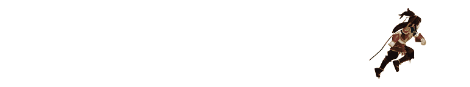

## Animate.css动画（补充学习）

Animate.css动画是一款提前封装好css预定义动画，实际开发中我们不需要自己动画，直接调用动画库中的class类名即可；

https://www.dowebok.com/demo/2014/98/

### 使用步骤

**第一步：**将动画库的css文件animate.min.css或animate.css拷贝到自己的项目中并且link引入

```html
 <link rel="stylesheet" href="./css/animate.min.css">
```

**第二步：**哪一个盒子需要加载动画，就直接用class调用animated类名，表示调用了动画库，然后去动画库的demo中查找想要的动画形式的类名，多类名调用；

```html
 <div class="animated bounceInLeft">我们是可爱的程序员</div>
```

**第三步：**实现页面滚动到某一个位置再去加载动画，需要配合一个wow.js插件；

> 01.将wow.min.js复制到自己的项目的js文件中；
>
> 02、将代码复制到自己的html结构的最后面 
>
> ```html
> <script src="js/wow.min.js"></script>
> <script type="text/javascript">
>    /*初始化自动动画wow.min.js插件*/
>     new WOW().init();
> </script>
> ```
>
> 03、哪一个盒子需要书写等待加载，就在class调用wow类名即可
>
> ```html
>  <div class=" animated bounceIn wow">我们是可爱的程序员</div>
> ```

**第四步：**实现延时动画，自己定义对应延时样式，然后哪一个盒子需要延时就直接调用自己写的类名；

> 01、定义延时css
>
> ```css
> /* 定义延时动画 */
> .yanshi1 {
>   animation-delay: 0.3s;
> }
> .yanshi2 {
>   animation-delay: 0.6s;
> }
> ```
>
> 02、html调用延时
>
> ```html
> <li class="animated bounceInUp wow yanshi2">
> ```

### 目标案例

完成健身网站的动画效果；


