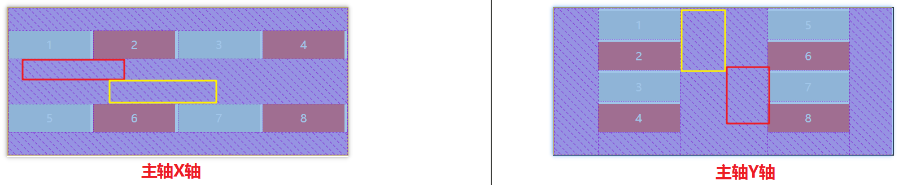
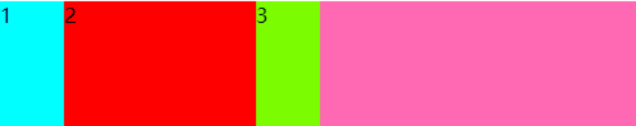

# 第三天

## 目标

前面咱们学习的都是pc端脑端的网页布局，随着互联网的发展，现在的人基本都是人手一部手机，前端不光要做pc的网页布局，也要做手机端的布局；

我们主要学习以下相关知识：

01、了解移动端的特点；

02、了解百分比布局的思维和相关案例；

03、掌握Flex布局的相关知识；

04、完成小兔仙确认订单页面和小兔仙PC页面布局；

## 移动端和PC网页的区别

> PC端屏幕大，网页内容需要固定到一个版心当中，然后在浏览器中居中显示；
>
> 移动端手机屏幕小，网页宽度多数为100%，不需要版心控制；
>
> 移动端目前还有一个现状，手机屏幕尺寸大小不一，其实移动端布局的难点就是用来兼容各个尺寸屏幕的；

## 谷歌模拟器

右键检查或者F12调出控制台，点击切换到移动端浏览；


## 物理分辨率、逻辑分辨率和物理像素比（了解）	

做移动端开发我们要了解物理分辨率、逻辑分辨率和物理像素比的关系；

### 物理分辨率

物理像素也即是设备像素（device pixel, dp），是指**设备屏幕实际拥有的像素点**，屏幕的基本单元，<font color="red">**物理像素在屏幕出厂时就已经确定了，不会再改变**</font>。

比如iPhone6/7/8（750 x 1334） Mac Pro（2560 x 1600）、iPhone XS （2436 x 1125），这里的数字 **750 x 1334** 指的就是物理像素。

苹果iPhone 8参数：https://detail.zol.com.cn/395/394162/param.shtml

苹果iPhone 12 Pro参数：https://detail.zol.com.cn/1344/1343108/param.shtml

所以按照苹果6/7/8 的物理分辨率，就是横着一行可以显示750个像素点，竖着一列可以显示1334个像素点；

### 逻辑分辨率

viewport视口中的一个小方格，CSS样式代码中使用的是逻辑像素。在Retina屏幕（视网膜屏）里面，**1逻辑像素由多个物理像素来显示**；一般的逻辑分辨率和物理分辨率都存在一个倍数关系称为dpi，<font color="red">**可以理解为视网膜屏技术会将更多的物理像素点压缩到一块屏幕里，从而达到更高的分辨率，并提高屏幕显示的细腻高清程度**</font>；

**比如：**iPhone6/7/8的物理分辨率是758*1334，逻辑分辨率则是375 * 667,两者存在一个2倍的dpi关系；

**简单的理解：**物理像素中我们将1px看成一个房间，我们一个房间中是一盏灯照亮的，然而在逻辑像素中我们也把1px看做一个房间，但是这个房间中有两盏灯照亮,这时房间会更亮；


### 设备像素比dpi

设备像素比(DevicePixelRatio)指的是设备物理像素和逻辑像素的比例 。定义了物理像素和逻辑像素之间的关系。

### 实际开发中的换算原理

我们还是以iPhone6/7/8为例说明

> iPhone6/7/8的物理分辨率是750*1334，逻辑分辨率则是375 * 667,两者得到dpi是2倍的dpi关系；
>
> <font color="red">**实际开发中我们以逻辑分辨率为准开发**</font>，这时候 两者的换算关系是：
>
> 例如： width: 2px; height: 1px; 的色块，在 DPR 不同的设备上，所需要的物理像素个数是不同的
>
> 
>


### 实际开发中的UI设计稿 --- 2倍图（重点）

实际开发中UI设计师给我们设计稿是按照750*1334的大小设计的，那么设计稿是按照实际的iphone6/7/8的物理分辨率设计的，那么物理分辨和逻辑分辨就会有一个2倍的dpi关系，我们也将设计稿称为2倍设计稿图（2倍图）；

<font color="red">**关于2倍图**</font>

在手机的视网膜屏Retina中打开的图片，会按照设备像素比dpi放大倍数，会造成图片模糊的问题；我们可以通过2倍图来解决这个问题；

比如我们在视网膜屏Retina中设置了一张50px*50px的图片，按照dpi的大小在物理像素中会放大对应的倍数，这样就会导致图片模糊，所以我们可以在做设计稿和切图的时候按照2倍或者多倍的形式进行，比如2倍大小100px*100px，我们直接在视网膜屏Retina中书写大小的时候将100缩小两倍书写成50，这时候在物理像素中就算是放大了也不会失真模糊；


## 视口

### 基本概念

> viewport就是设备的屏幕大小（浏览器显示页面内容的屏幕区域）；
>
> 默认的视口大小是980px，是苹果公司规定的；
>
> 如果不设置视口相关属性，视口就默认大小980，不管你的屏幕是多少，
>
> 如果设置了视口，浏览器的显示区域就会跟随屏幕大小自己计算；

### meta视口

```html
<meta name="viewport" content="视口的属性" />
```

```html
<meta name="viewport" content="width=device-width, user-scalable=no, initial-scale=1.0, maximum-scale=1.0, minimum-scale=1.0">
```

> **width=device-width** ----  视口的宽度是设备屏幕的宽度；
>
> **initial-scale**：初始比例，页面加载时的默认比例1.0；
>
> **user-scalable**：指定用户是否可以对页面进行缩放 yes或者1允许/no或者0不允许；
>
> **minimum-scale**：最小允许缩放的比率1.0，取值为1.0表示不允许缩放；
>
> **maximum-scale**：最大允许缩放的比率1.0，取值为1.0表示不允许缩放；

<font color="red">**实际开发中我们只需要设置width=device-width，initial-scale，user-scalable**</font>

```html
 <meta name="viewport" content="width=device-width, initial-scale=1.0,user-scalable=no">
```


## 百分比布局（流式布局）

### 基本概念

通过将盒子的宽度设置成百分比来根据屏幕的宽度来进行伸缩，不受固定像素的限制，内容向两侧填充。

**理解为：将父级盒子的宽度按照百分比的占比，分配给各个子盒子即可；**

百分比布局一般是将盒子高度设置为固定，但是现在市场需求可以不用设置固定的高度。

### 目标案例

一个父级盒子有5个子级盒子那么我们可以将子级盒子的宽度设置为20%左浮动进行布局。


> 大盒子高度是45px；
>
> 小图标宽度60px；

### 限制body的最大宽度（了解）

实际开发中我们可以按照设计稿的宽度将页面的最大宽度控制，让页面超出了设计稿的宽度时直接强制限制页面的宽度就是设计稿的宽度，可以给body控制最大最小的宽度，控制页面的显示样式；

```css
body {
  width: 100%;
  max-width: 750px;
  min-width: 320px;
  margin: auto;
}
```

## 圣杯布局（双飞翼布局）

一个父级盒子中，左右两边的盒子大小不变，中间的盒子宽度跟随浏览器的大小改变进行改变；

**传统的布局思路**

以父级盒子为参照将左右两个子级盒子大小固定，然后子绝父相定位在父级两侧；
两侧的盒子定位以后脱离了标准流，中间的盒子依然在标准流里面，默认的宽度就和父级一样，我们可以设置高度，用margin设置作用的外边距，将盒子挤压到中间；

https://m.jd.com/

## ★★★Flex布局

Flex 是 Flexible Box 的缩写，意为"弹性布局"；

flex布局是浏览器提倡的布局模型，布局简单，灵活，可以避免浮动布局脱标的问题；

### Flex布局和传统布局的区别

> **传统布局：**兼容性好，布局繁琐，局限性在移动端不能很好布局；
>
> **Flex布局：**简单，操作方便，兼容性差（随着技术的发展可能会成为主流的布局）；
>
> Pc采用传统布局，移动端或者不考虑兼容的pc端，可采用flex布局；

### Flex布局原理

实际开发中我们可以给父级开启Flex布局，只需要给父级盒子设置 display: flex;属性即可；

**任何一个盒子都可以开启弹性布局，不管是块元素还是行内元素；只需要设置 display: flex; 属性，当前的盒子就开启了弹性布局，里面子元素就会自动的挤压或者压缩进行布局；**

### **Flex布局的组成部分**

> 容器（父级盒子）
>
> 项目（子元素）
>
> 轴：分为主轴和侧轴，默认的主轴是X轴，侧轴也叫交叉轴；		


### Flex布局容器（父级盒子）常见的属性设置

####  display: flex;

必须设置给父级盒子，表示开启了Flex弹性布局；

#### flex-direction

设置Flex布局的主轴方向；

##### <font color='red'>**取值为row**</font>

默认取值，主轴改为x轴，横轴，从左到右；

```css
 flex-direction:row; 
```

 

##### <font color='red'>**取值为column**</font>

将主轴改为y轴，纵轴，从上到下；

```css
flex-direction:column;
```


##### 取值为**row**- reverse或者column- reverse（了解）		

row-reverse主轴为x轴，并且翻转，从右到左翻转排列；	

column- reverse主轴为y轴，并且翻转，从下到上翻转排列 ；		

```css
flex-direction:row- reverse;	
```

```css
 flex-direction:column- reverse;
```


#### justify-content

通过justify-content能够设置主轴子元素排列形式,但是注意使用这个属性之前一定要确定好主轴

##### 取值flex-start

默认值，所有子元素在主轴头部开始显示，如果是X轴，则从左到右，如果是Y轴，则从上到下；

```css
justify-content:flex-start;
```


##### 取值flex-end

所有子元素在主轴尾部开始显示，如果是X轴，则所有元素靠右显示，如果是Y轴，则所有元素靠下显示；	

```css
justify-content:flex-end ;
```


##### 取值center（常用）			

所有子元素在主轴居中对齐		

```css
justify-content:center;
```


##### 取值为space-around	

所有子元素平分剩余空间		

```css
justify-content:space-around ;
```


##### 取值为space-between（常用）

所有子元素中，先两边两个元素贴边，剩余的元素平分剩余空间（常用）;		

```css
justify-content:space-between;
```


##### 取值为space-evenly	

所有子元素之间的距离都一致	

```css
justify-content:space-evenly ;
```


#### flex-wrap


规定子元素是否换行显示；

在flex布局中，如果子元素的总宽度加起来超出了父级的宽，默认是不会自动换行的，会按照比例压缩一行显示，不会换行；

##### 取值nowrap

开启flex布局后项目（子元素）默认不换行，默认情况下项目（子元素）都排在一条线上（轴线），如果子元素的总宽度加起来超出了父元素的宽度，子元素就会压缩显示，不会换行；

```css
flex-wrap:nowrap;
```

##### 取值wrap（常用）

如果想要子元素实现换行效果，就需要给容器（父级盒子）设置flex-wrap：wrap；

```css
flex-wrap：wrap；
```


#### align-items（只设置单行）

单行排列的子元素，父级没有设置flex-wrap：wrap；换行属性的时候，设置侧轴子元素的排列；

##### 取值为flex-start（常用）

> 交叉轴的起点对齐；
>
> 简单理解为 ---- 子元素在侧轴方向从头往后排列；

```css
align-items:flex-start ;
```


##### 取值为flex-end

> 交叉轴的终点对齐；
> 简单理解为 ---- 子元素在侧轴方向从尾部往前排列；	

```css
align-items:flex-end;
```


##### 取值为center（常用）	

> 交叉轴的中点对齐;
> 简单理解为 ---- 子元素在侧轴方向居中排列；

```css
align-items:center;
```


##### 取值为stretch

> 默认值(拉升)，如果项目（子元素）未设置高度或设为auto，将占满整个容器（父元素）的高度；
> 简单理解为 ---- 子元素没有设置固定高度的情况下会将子元素拉伸的和父级盒子一样高；

```css
align-items:stretch;
```


#### align-content（只设置多行）

父级设置flex-wrapwrap；子元素换行的情况下，设置侧轴子元素的排列方向；

如果子元素的高度或者宽度加起来没有和父级盒子的宽高一致，就会出现下图间距不符合要求，我们就可以使用

align-content来设置；


<font color="red">**建议：实际开发中如果需要多行显示子元素，我们推荐不要给父级盒子设置固定的高度，子元素撑开即可；**</font>

##### 取值flex-start

> 交叉轴的起点对齐；
> 简单理解为 ---- 子元素在侧轴方向从头往后排列；

```css
align-content:flex-start; 
```


##### 取值flex-end

> 交叉轴的终点对齐；
> 简单理解为 ---- 子元素在侧轴方向从尾部往前排列；

```css
align-content:flex-end; 
```


##### 取值center

> 交叉轴的中点对齐；
> 简单理解为 ---- 子元素在侧轴方向居中排列；

```css
align-content:center; 
```


##### 取值space-around

子元素在侧轴平分除所有子级盒子占有的空间以外的剩余空间；

```css
align-content:space-around; 
```



##### 取值space-between

子元素两头的元素先对其在两头，剩余的子元素再去平分剩余的空间；

```css
align-content:space-between; 
```


##### 取值为stretch

默认值（拉升），如果项目未设置高度或设为auto，将占满整个容器的高度；

```css
align-content:stretch; 
```


### 目标案例1

> 大盒子宽度为996px，高度为304px；
>
> 小盒子宽度为242px，高度为304px；


### 目标案例2

> 大盒子宽度为992px，高度为610px；
>
> 小盒子宽度为242px，高度为304px；
>
> 要求实现基本的布局结构即可，里面的内容自己完成哦；


### Flex布局项目（子级盒子）常见属性设置

#### flex

将容器（父级盒子）剩余空间按照占比分配给各个子盒子；

##### 取值实际的数字

```css
flex: 1;
```

**注意：**将全部的子元素的占有的份数加起来就是父级分的总的份数；

#### ★★★面试题（重点）

**什么是felx布局？flex属性数哪些属性的缩写？**

所谓的flex布局，指的就是给父级盒子设置了display:flex;开启了flex布局，浏览器会重新将子元素一行压缩显示；

flex实际代表的是三个属性的简写：


##### flex-grow

用于**分配容器的剩余空间**；

如果子元素的宽度加起来没有和父级盒子一样宽，或者子元素没有设置宽度，这时父级盒子就会剩余一些空间，我们可以通过flex-grow将剩余的空间分配给所需子元素；

```html
       <style>
        .box {
            display: flex;
            width: 500px;
            height: 100px;
            background-color: hotpink;
        }

        .box span {
            width: 100px;
        }

        .box span:nth-child(1) {
            flex-grow: 1;
            background-color: aqua;
        }
    </style>
	<div class="box">
        <span>1</span>
        <span>2</span>
        <span>3</span>
    </div>
```

以上代码父级盒子的宽度是500，每一个span盒子的宽度是100，三个盒子加起来的总宽度没有等于或者大于父级盒子的宽度500；我们给第一个span盒子设置了flex-grow:1;表示将父级的所有剩余空间都分配给了第一个span；

所以第一个span的宽度为100+父级剩余的200 = 300；


再比如以下代码：	

```html
    <style>
        .box {
            display: flex;
            width: 500px;
            height: 100px;
            background-color: hotpink;
        }

        .box span {
            width: 100px;
        }

        .box span:nth-child(1) {
            flex-grow: 1;
            background-color: aqua;
        }

        .box span:nth-child(2) {
            flex-grow: 3;
            background-color: red;
        }

        .box span:nth-child(3) {
            flex-grow: 1;
            background-color: lawngreen;
        }
    </style>
    	<div class="box">
        <span>1</span>
        <span>2</span>
        <span>3</span>
    </div>
```

以上代码父盒子剩余空间的200，按照以上代码将父盒子的剩余空间分成了5份

> 第一个盒子分配1/5，100+40 = 140
>
> 第二个盒子分配3/5，100+120=220
>
> 第三个盒子分配1/5，100+40= 140				
> 		

##### flex-shrink:1

> flex-shrink用来设置子盒子超过父盒子的宽度后，进行缩小的比例取值；
>
> 如果子元素的宽度加起来超出了父级元素的宽度，我们可以使用flex-shrink的取值来进行相应的比例缩小；

```html
    <style>
        .box {
            display: flex;
            width: 500px;
            height: 100px;
            background-color: hotpink;
        }

        .box span {
            width: 200px;
        }

        .box span:nth-child(1) {
            flex-shrink: 1;
            background-color: aqua;
        }

        .box span:nth-child(2) {
            flex-shrink: 3;
            background-color: red;
        }

        .box span:nth-child(3) {
            flex-shrink: 1;
            background-color: lawngreen;
        }
    </style>
 	<div class="box">
        <span>1</span>
        <span>2</span>
        <span>3</span>
    </div>
```

以上代码表示：三个span的宽度加起来超出了父元素的宽度500，多出了100，然后利用flex-shrink多余的100px按照取值比例分配给各自的span；

> 第一个盒子：1/5 * 100 = 20 最终第一个盒子200-20=180
>
> 第二个盒子：3/5 * 100 = 60 最终第二个盒子200-60 = 140
>
> 第三个盒子：1/5 * 100 = 20 最终第一个盒子200-25=180


##### flex-basis:0%

> 设置盒子的基准宽度，取值一个长度单位或者一个百分比，规定灵活项目的初始长度。
>
> 如果basis和width同时存在会把width覆盖掉（干掉）；

```html
    <style>
        .box {
            display: flex;
            width: 500px;
            height: 100px;
            background-color: hotpink;
        }

        .box span {
            width: 200px;
        }

        .box span:nth-child(1) {
            flex-basis: 50px;
            background-color: aqua;
        }

        .box span:nth-child(2) {
            flex-basis: 150px;
            background-color: red;
        }

        .box span:nth-child(3) {
            flex-basis: 50px;
            background-color: lawngreen;
        }
    </style>
    <div class="box">
        <span>1</span>
        <span>2</span>
        <span>3</span>
    </div>
```

以上代码一开始给所有的span都统一设置了固定的宽度200，但又单独给每一个span设置了flex-basis，此时span原始的宽度width被flex-basis的取值覆盖干掉了哦！！



#### order

项目（子级盒子）的排列顺序。	

取值是实际的一个数值，数值越小，排列越靠前，默认为0

```css
 order: -1;
```

以下效果是给第二个盒子设置了order取值为-1,此时盒子2会排在前面；


#### align-self（一般在单行使用）

单个项目有与其他项目不一样的对齐方式设置，可覆盖align-items属性；

```css
align-self: flex-start;
align-self: flex-end;
align-self: center;
align-self: stretch;
```

**注意**：stretch是子元素不设置固定的高度的情况下生效


## 目标案例 -- 小兔仙填写订单


## 目标案例 -- pc端


