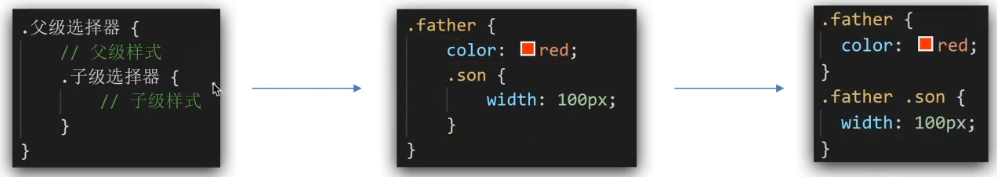
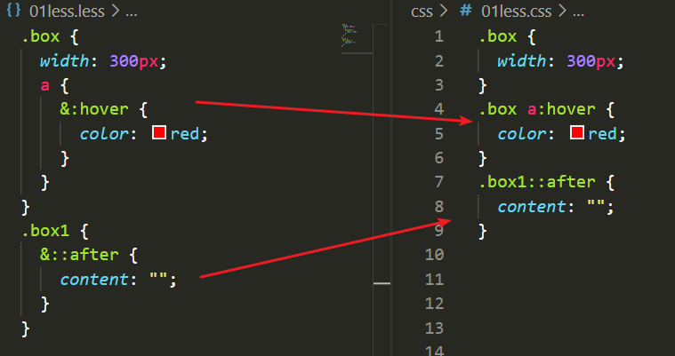
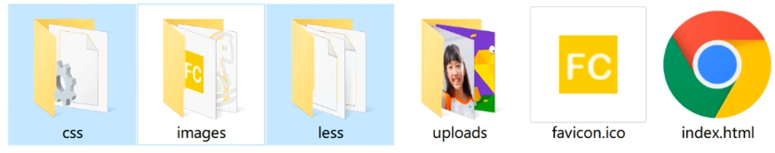
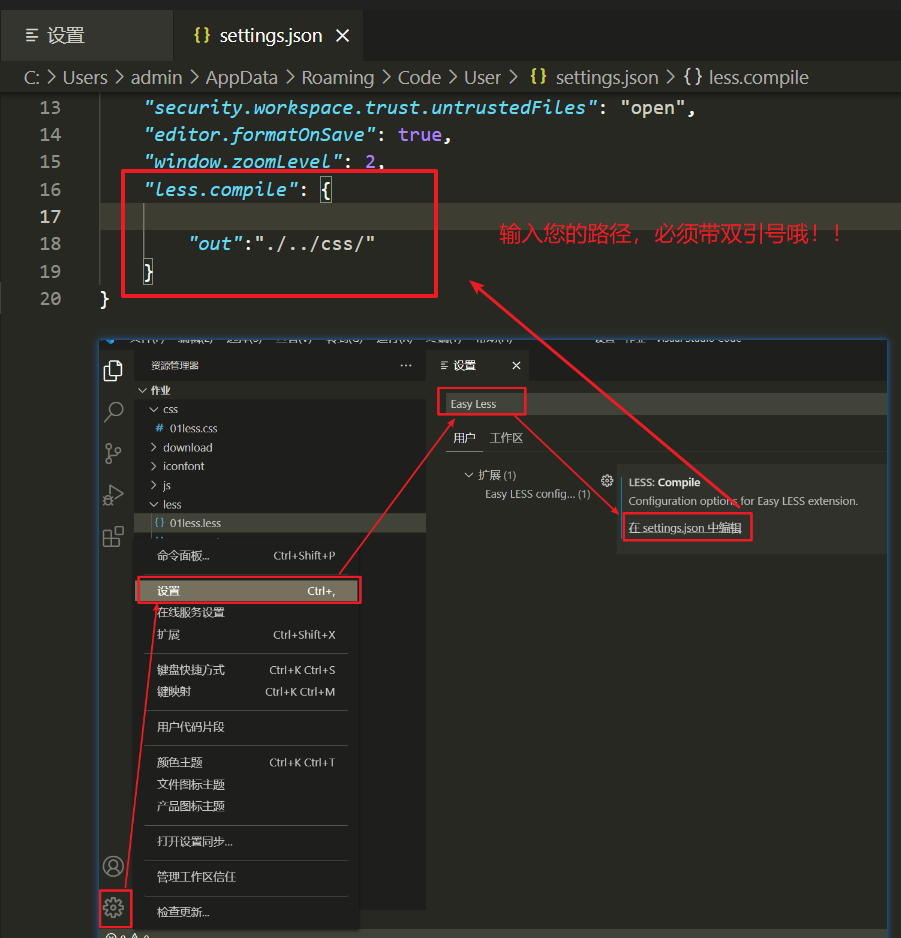
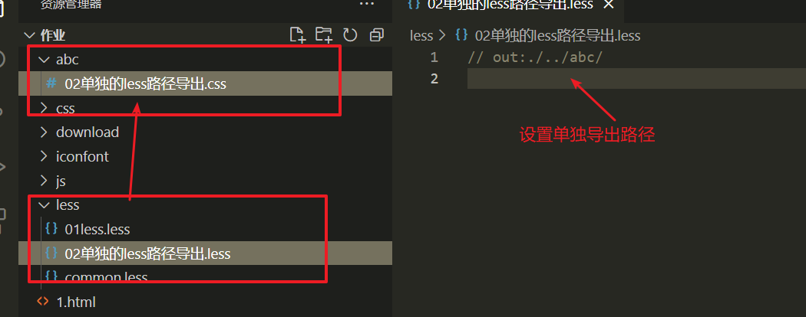
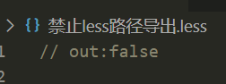

# 第五天、第六天

## 目标

01、掌握媒体查询的基本语法；

02、掌握less的基本语法并且能够使用less；

03、掌握移动端布局rem单位，并能够使用rem单位进行移动端页面布局；

04、掌握vw和vh单位，能够使用vw单位进行移动端网页布局；

## 媒体查询

实际开发可能会存在不同尺寸的屏幕大小，我们就需要用媒体查询来判断不同屏幕大小，然后设置各自不同的css样式；

### 基本语法

```css
@media mediatype and|not|only (media feature) {
    css样式
}
```

#### mediatype（媒体类型）

all（所有设备）print（打印设备） **screen（用于电脑、平板、手机屏幕）**

#### and|not|only（关键字）

and 将多个媒体特性链接到一起，相当于且  ，not排除某一个 ， only 特定的某一个

#### media feature（媒体特性）

必须有小括号包裹，小括号里面书写css样式；

一般情况下我们只需要判断width ，定义输出设备中页面可见区域的宽度（屏幕宽度）；

> max-width最大宽度，不能再大于这个宽度了，小于这个值；
> min-width最小宽度，不能再小于这个宽度了，大于这个值；

例如：

```css
@media screen and (max-width:800px) {css样式}
```

### 目标案例1：

设置一个类名为box的div盒子，分别设置后面三个档次的样式；

> 第一档：屏幕的宽度 <540 的时候盒子背景颜色更改为pink色；
>
> 第二档：屏幕的宽度>=540 的时候盒子的背景颜色更改为green色；
>
> 第三档：屏幕的宽度 >=970 的时候盒子的背景颜色更改为gold色；

### 目标案例2 -- 京东效果

要求：当屏幕的大小大于1350px宽度的时候，大盒子中的子盒子一行显示4个，当小于1350px的时候只显示三个，将第三个隐藏；大盒子的宽度也会更改为990px；

大盒子宽度1190px，高度470px；

> 第一个小盒子宽度190px；
>
> 第二个小盒子宽度590px；
>
> 第三个小盒子宽度190px；
>
> 第四个小盒子宽度190px；


## less

### 定义

> less是一门css预处理语言，扩展了css的动态特性；
>
> less扩充了css语言，使css具备一定的逻辑性、计算能力。

**注意：**浏览器是不识别less代码的，我们最终引入页面的还是css文件，需要借助“Easy Less”插件翻译转化为css文件；

### Easy Less 插件

将less文件翻译为css文件；

### 注释

> 单行注释  //注释内容    -----    快捷键 ctrl+ ?
>
> 块注释（多行注释）/* 注释内容*/ ----- 快捷键 Shift+Alt+ A

### 计算

> 进行+、-、*、/等运算；
>
> 除法 / 运算一定要添加小括号才能生效，(100px / 3) 或者 ./ 但是语法会报错不推荐使用；

### 运算的单位

> 01、如果运算的两个值都有单位，则以第一个单位为主；
>
> 02、如果只有一个单位就以这个单位为主；

### 嵌套

实现快速选择后代，最终生成后代选择器的样式选择。
	

注意：伪类选择器和伪元素书写的时候前面需要加&符号才能生效



### 变量

没有固定的值，可以改变的，我们可以把我们一些常用的样式比如颜色和数值等定义成变量重复使用；

#### 语法

@变量名称:值；

```less
@color: pink;
```

**注意：**定义变量结束最后一定要跟英文封号；

#### 变量的命名规范

必须有@为前缀，不能包含特殊字符，不能以数字开头，大小写是单独的大写和小写的含义是不同的；

### 样式导入

将一些公用的样式，直接导入到对应的样式文件中，不需要用link引入；

**语法**

```less
@import "./common.less";
@import "./common";
```

**注意：**

> 导入语句@import最后结束一定要写英文封号；
> 导入的文件是可以省略不写.less 文件后缀的。
> 导入语句要书写在导入文件的的最前面；

### 导出路径设置

实际开发中我们需要将less文件和css文件分开保存，所以我们需要设置less翻译成css的存储位置；



#### Easy Less插件导出路径设置

**设置 → 搜索Easy Less → 在setting.json中编辑 → 在less.compile中添加代码----"out":"您的路径"；**

**注意：**导出的路径是统一的，所有的less将会一致导出到设置的路径里面



#### 单独路径导出

**语法**：

```less
 // out：您要导出的路径 
```

如果需要将一个less文件导出到单独特定的文件路径中，不需要放在统一设置的路径，我们需要在当前的less文件第一行书写；



**注意：**

> 书写单独输出路径的时候最后面不需要加封号；
>
> 必须写在less文件的第一行；
>
> out后面的冒号必须是英文的冒号；

#### 禁止导出css文件

有些公用的样式不需要导出css，直接用@import导入到其他文件即可，那么我需要设置禁止导出为css语句控制；
**语法：**

```less
// out:false
```

注意：禁止导出语句一定要写在文件的第一行，后面一定不能写封号；




## rem布局

### rem相关知识

rem是相对单位，是相对于根标签HTML标签文字大小计算得来的结果。所谓的根标签指的就是html标签

**1rem = 1个html根标签文字大小**

> <font color="hotpink">**实际的px像素大小 = rem值*根标签html的文字大小**</font>

### 体验案例1

规定根标签html的文字大小为20px，然后体验一个类名为box的盒子宽高分别为5rem和3rem的变化

### ★★★rem适配原理（掌握）

#### 原理

**将设计稿给出的px像素值**，通过技术手段**转化为对应的rem相对值**，从而**实现在不同的视口下**通过我们计算的rem值实现元素的缩放；

**简单的理解：**我们将设计稿的px单位大小，转化为rem单位，rem可以实现不同大小屏幕下的缩放适配；

#### **将设计稿中的实际大小转化为rem值**

> <font color="red">**rem值 = 实际的px像素 ÷ 根标签html的文字大小**</font>

#### 媒体查询实现不同大小屏幕下的根标签html文字小

目前市场上手机屏幕大小不一，我们在做移动端网页布局的时候需要做到适配，最常见的手机屏幕大小有320px，360px,375px,384px,400px,414px,424px,480px,540px,720px,750px等，我们目前只需要能够兼容这些屏幕尺寸即可；

为了兼容不同的屏幕大小，我们可以**人为将屏幕分为10等份**，然后用利用不同屏幕的宽度除以份数，求出不同屏幕下根标签html的文字大小；

> <font color="red">**html文字大小 = 屏幕宽度 ÷ 10**</font>

**注意：**将屏幕分的份数不一定是10份，可以是任意的份数，只不过10相对好计算而已；

```css
        @media screen and (min-width:320px) {
            html {
                font-size: 32px;
            }
        }

        @media screen and (min-width:360px) {
            html {
                font-size: 36px;
            }
        }

        @media screen and (min-width:375px) {
            html {
                font-size: 37.5px;
            }
        }

        @media screen and (min-width:384px) {
            html {
                font-size: 38.4px;
            }
        }

        @media screen and (min-width:400px) {
            html {
                font-size: 40px;
            }
        }

        @media screen and (min-width:414px) {
            html {
                font-size: 414px;
            }
        }

        @media screen and (min-width:424px) {
            html {
                font-size: 42.4px;
            }
        }

        @media screen and (min-width:480px) {
            html {
                font-size: 48px;
            }
        }

        @media screen and (min-width:540px) {
            html {
                font-size: 54px;
            }
        }

        @media screen and (min-width:720px) {
            html {
                font-size: 72px;
            }
        }

        @media screen and (min-width:750px) {
            html {
                font-size: 75px;
            }
        }
```

#### 目标案例

游乐园游客微信端首页


## flexible.js适配

实际开发我们不需要自己去利用媒体查询语法去挨个计算适配，直接用flexible.js适配即可；

### 工作原理

flexible.js是将设备的视口平均划分为10份，然后再去按照不同的视口大小计算出各自的html根标签的文字大小；

### 使用方法：

第一步：将flexible.js拷贝到自己的项目中；

第二步：将flexible.js利用script标签引入到自己html页面的最后面

```html
<script src="./js/flexible.js"></script>
```

github地址：https://github.com/amfe/lib-flexible

官方文档地址：https://github.com/amfe/article/issues/17

## viewport（vw/vh）

使用视口单位vw来实现响应式排版。1vw等同于视口宽度的百分之一，即如果你用vw来设定字体大小的话，字体的大小将总是随视口的大小进行改变。

```css
h1 {
  font-size: 6vw;
}
```

### vw/vh

根据视口的宽高进行相对单位大小计算结果；

#### vw 适配

视口宽度viewport width 

```
1vw = 1/100 * 视口宽度
```

> 01、确定设计稿对应的vw尺寸（1/100*视口宽度）；
> 02、vw单位的尺寸 = px实际像素数值 / (1/100*视口宽度)；

**比如**：视口的宽度是375px，那么1vw=3.75px；

#### vh适配

视口高度viewport  height

```
1vh = 1/100 *视口高度
```

> 01、确定设计稿对应的vh尺寸（1/100*视口高度）；
> 02、vh单位的尺寸 = px实际像素数值 / (1/100*视口高度)；

**比如**：视口的宽度是667px，那么1vw=6.67px；

### 目标案例

哔站以移动端页面效果

https://m.bilibili.com/

# 作业

01、利用vw适配完成 租房页面首页；

02、利用vw适配或者rem完成苏宁易购首页；


