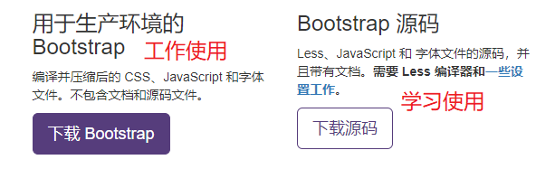
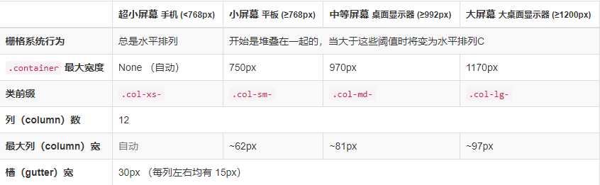
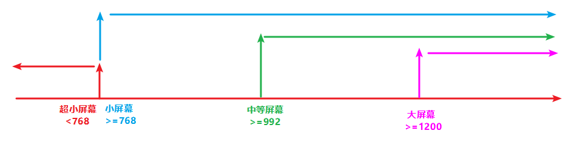
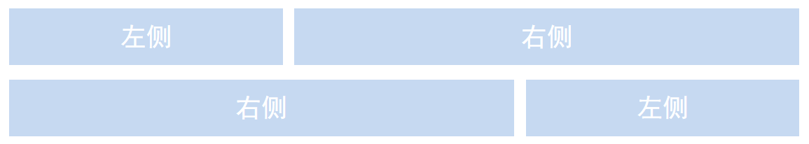
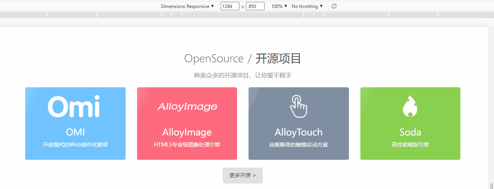
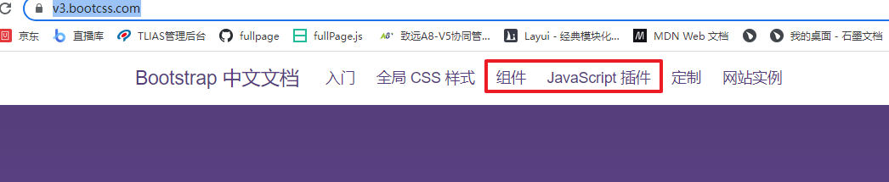

## 目标

01、了解响应式布局的原理；

02、能够使用媒体查询完成响应式布局的案例；

03、能使用Bootstrap完成响应式网页布局；

## 响应式开发

### 响应式开发原理

通过媒体查询判断不同的屏幕的大小，然后设置不同的样式；

### 响应式布局容器

在不同屏幕下，通过媒体查询来改变这个布局容器的大小，再改变里面子元素的排列方式和大小，从而实现不同屏幕下，看到不同的页面布局和样式变化。使用媒体查询针对不同宽度的设备进行布局和样式的设置，从而适配不同设备的目的。

**常见屏幕尺寸下布局容器大小设置**

> 超小屏幕（手机、小于768px）：设置宽度为100%；
>
> 小屏幕（平板，大于等于768px）：设置宽度为750px；
>
> 中等屏幕（桌面显示器，大于等于992px）：设置宽度为970px；
>
> 大屏幕（大桌面显示器，大于等于1200px）：设置宽度为1170px；

### 目标案例1

container盒子在不同屏幕下宽度和背景颜色不同

### 目标案例2

一个父级盒子中有12个li，当屏幕的宽度 >=992的时候，一行并排放4个，当屏幕 宽度>=768的时候一行并排放3个，当屏幕宽度 <768的时候一行并排放2个；

**注意：父级盒子就是布局容器，要根据不同屏幕大小去设置不同大小；**

## Bootstrap

### 简介

Bootstrap来自Twitter（推特），基于HTML、css和javascript开发。简洁灵活，使web开发更加快捷；

中文网站：http://www.bootcss.com/

### 下载

	

### 常用操作

将下载的生产环境文件夹直接复制到自己的项目中，并且引入css文件；

```html
 <link rel="stylesheet" href="./bootstrap-3.4.1-dist/css/bootstrap.min.css">
```

#### 布局容器 --- container 类

为了兼容不同的屏幕大小，bootstrap根据不同屏幕返回设置了各自的布局容器（理解为版心），我们可以在布局容器中进行对应的css样式设置，有以下四种情况：

> 大屏 ( >=1200px)  宽度定为 1170px
>
> 中屏 ( >=992px)   宽度定为  970px
>
> 小屏 ( >=768px)   宽度定为  750px
>
> 超小屏 ( <768px)   宽度定为 100%

#### 行 --- row

> row类名表示行，默认左右有-15的外边距，布局容器container中嵌套可以消除默认的内边距；
>
> 做栅格系统布局的时候，所有“列（column）必须放在 ” `.row` 内。

#### 栅格系统

##### 基本使用

Bootstrap将布局容器分成了12份，然后配合媒体查询对不同大小屏幕下的盒子占有的份数不同进行响应式设置；
栅格系统是分为行和列的


**注意：**所有的col-类名都是向上兼容；


**注意：**

> 如果一行的栅格数量不够12 就会空出来；
>
> 如果一行的栅格数量总和超出了12 ，最后一个会折行显示；

##### 栅格系统列偏移

.col-md-offset-* 

如果说子元素总的占有的列数不足12，就可以用-offset-后面紧跟剩余的列数实现向右偏移；


**思考案例：**如果栅格系统中只有一个盒子，并且盒子占有栅格系统的数量是8，让这个盒子水平居中显示；

##### 嵌套列

可以在子元素的盒子中在次的嵌套一个row ，里面按照12分可以再次布局；

##### 列排序

通过使用 `.col-md-push-*` 和 `.col-md-pull-*` 类就可以很容易的改变列（column）的顺序。



##### 目标案例：

利用栅格系统完成腾讯全端列表样式布局

http://alloyteam.com/



### 组件体验学习

按照文档按照需求查阅使用

https://v3.bootcss.com/



**完成导航定制体验**

### 响应式工具

实现响应式的显示隐藏，可以让特定的盒子在规定的屏幕下显示隐藏；

hidden-xs           超小屏幕下隐藏                 visible-xs            超小屏幕下可见   
hidden-sm         小屏幕下隐藏	            visible-sm          小屏幕下可见 
hidden-md          中等屏幕下隐藏                visible-md         中等屏幕下可见 
hidden-lg            大屏幕下隐藏                        visible-lg         大屏幕下可见 


## 目标案例

### 腾讯全端 http://alloyteam.com/

### 阿里百秀https://www.alibaixiu.cn/


